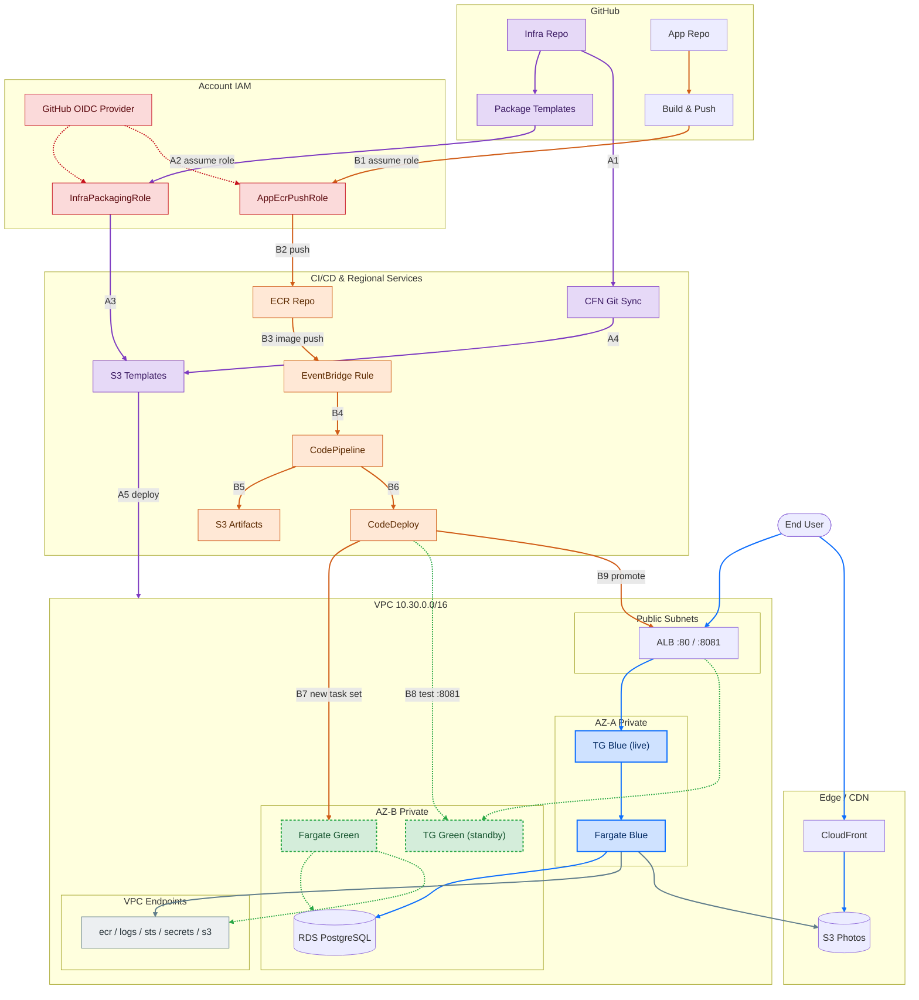

# photo-uploader-infra

All infrastructure for the **Photo Uploader** lab: a highly available,
containerized fullstack photo gallery on **Amazon ECS Fargate**, in a
custom multi-AZ VPC, behind a public ALB, deployed via **CodePipeline +
CodeDeploy blue/green**, triggered automatically by container image
pushes. Images live in a **private S3 bucket** served exclusively through
**CloudFront** (Origin Access Control, no public bucket access); photo
descriptions live in **RDS PostgreSQL**. All infrastructure is
**CloudFormation**, deployed via **Git sync**; all CI/CD-to-AWS calls use
**OIDC** — no long-lived AWS credentials anywhere.

The application code lives in a separate repo:
[`photo-uploader-app`](https://github.com/1MuhireDavid/photo-uploader-app).

```
photo-uploader-infra/
├── README.md                 (this file)
├── bootstrap/00-bootstrap.yaml    # deployed ONCE, manually (see below)
├── cfn/
│   ├── root.yaml               # master template -- what Git sync deploys
│   ├── deployment-file.yaml     # Git sync's parameters/tags file
│   └── nested-templates/
│       ├── 01-network.yaml         # VPC, public+private subnets x2 AZ (no NAT)
│       ├── 02-security.yaml         # least-privilege security groups
│       ├── 03-vpc-endpoints.yaml      # interface/gateway VPC endpoints
│       ├── 04-storage-cdn.yaml        # private S3 photos bucket + CloudFront (OAC)
│       ├── 05-database.yaml            # RDS PostgreSQL (photo metadata)
│       ├── 06-alb-ecs.yaml              # ALB, ECS cluster/service, autoscaling
│       └── 07-cicd-pipeline.yaml         # CodePipeline, CodeDeploy, EventBridge
├── diagram/architecture.drawio    # architecture diagram (draw.io / diagrams.net)
└── .github/workflows/package-templates.yml
```

## Architecture diagram

Renders natively on GitHub -- no external tool needed. `diagram/architecture.drawio`
remains the fully-detailed, hand-editable version (see "Viewing / editing the
diagram" below); this Mermaid version is the at-a-glance summary embedded here.



### Legend

**Color coding**

| Color | Meaning |
|---|---|
| 🟦 Blue | Live / prod traffic path (BLUE task set) |
| 🟩 Green (dashed) | Standby / deploy-candidate path (GREEN task set) |
| ⬜ Gray | VPC interface/gateway endpoints |
| 🟪 Purple | Infra repo / IaC delivery |
| 🟧 Orange | CI/CD (ECR, EventBridge, CodePipeline, CodeDeploy) |
| 🟥 Red | IAM / OIDC trust |

**Path A -- IaC / infra pipeline** (push to `photo-uploader-infra`, `main`):
A1 push triggers `package-templates.yml`, which assumes `InfraPackagingRole`
via OIDC -- A2 hashes each nested template and uploads any whose content
actually changed to S3 -- A3 commits the changed hashes into
`deployment-file.yaml` -- A4 that commit is what Git Sync notices -- A5
Git Sync reads the (changed) templates from S3 and deploys/updates the
VPC, security groups, endpoints, ALB, ECS, RDS, and CDN.

**Path B -- App CI/CD & deployment** (push to `photo-uploader-app`, `main`):
B1 `build-and-push.yml` assumes `AppEcrPushRole` via OIDC -- B2 zips and
uploads `deploy-templates.zip` (appspec/taskdef) to the S3 artifact bucket
-- B3 builds and pushes the `:latest` image to ECR (deliberately after B2 --
see that step's own comment) -- B4 ECR `PUSH` event fires EventBridge -- B5
starts CodePipeline -- B6 pipeline reads both the image and the S3 zip from
B2 -- B7 hands both to CodeDeploy -- B8 CodeDeploy registers a new task
definition and launches the GREEN task set -- B9 points the ALB's `:8081`
test listener at GREEN for pre-production validation (waits here up to 5
min -- `aws deploy continue-deployment` promotes early, doing nothing
auto-promotes once the wait elapses) -- B10 on promote, shifts the ALB's
prod `:80` listener from BLUE to GREEN and terminates the old BLUE task
set 10 minutes later.

**Not shown on the diagram** (kept out of the visual per the no-NAT-Gateway,
least-privilege design -- see the bullets below for full detail): exact
security-group chain, target-tracking auto scaling (1-4 tasks, 60% CPU),
CloudWatch Logs retention, ECR tag/lifecycle policy, RDS Multi-AZ setting,
and CloudFront cache/price-class settings.

## Architecture

- **Network:** 1 VPC, 2 AZs, 2 public + 2 private subnets. **No NAT
  Gateway** — the private subnets have no internet route at all.
- **Compute:** ECS Fargate tasks in **private** subnets only, no public
  IPs. Pulled images, shipped logs, STS calls, and the RDS-managed DB
  credential fetch all travel over **interface VPC endpoints** (`ecr.api`,
  `ecr.dkr`, `logs`, `sts`, `secretsmanager`) plus a free **S3 gateway
  endpoint** (ECR layer storage + the app's own photo uploads) — every
  call an ECS task makes goes over a VPC endpoint, so there's nothing left
  that needs a NAT Gateway. (This does mean the very first deployment
  needs a real image already sitting in ECR, not a public placeholder —
  see "Full setup order" below.)
- **Exposure:** a public **ALB** is the only internet-facing compute
  resource; security groups form a strict chain (Internet → ALB SG → ECS
  task SG → {VPC endpoint SG on 443, RDS SG on 5432}), least privilege at
  every hop.
- **Images:** uploaded photos are stored in a **private** S3 bucket (all
  public access blocked) and served to browsers only through
  **CloudFront** using **Origin Access Control** — the bucket policy
  trusts nothing but this exact CloudFront distribution's ARN. The app
  writes to the bucket directly via its ECS task IAM role (no presigned
  URLs, no direct browser→S3 access, no CORS needed).
- **Metadata:** photo descriptions live in **RDS PostgreSQL**
  (`db.t3.micro`) in the same private subnets as ECS. The master
  credential is 100% RDS-managed (`ManageMasterUserPassword`) — it's
  generated and stored in Secrets Manager by AWS itself and injected into
  the container via the task definition's `Secrets` field; it never
  appears in any template, parameter, or repo.
- **Scaling:** target-tracking on `ECSServiceAverageCPUUtilization`,
  1 (min) / 1 (desired) / 4 (max) tasks.
- **Deploy:** ECS service uses `DeploymentController: CODE_DEPLOY`.
  EventBridge watches ECR for a `PUSH` of the `:latest` tag, starts
  CodePipeline, which hands the new image + `appspec.yaml`/`taskdef.json`
  (zipped and uploaded to S3 by the **app repo's** build workflow) to
  CodeDeploy for a blue/green traffic shift. The pipeline's S3 source
  action has `PollForSourceChanges: false` deliberately, so it never
  self-triggers on every zip upload — EventBridge is the sole trigger.
- **Pre-production validation:** the ALB has a second listener
  (`TestListenerPort`, default `8081`) alongside the prod one (`80`).
  CodeDeploy points it at the new "green" task set as soon as it's
  healthy, **before** any prod traffic shifts, then waits up to
  `DeploymentReadyWaitMinutes` (default 5) before continuing on its own
  (`DeploymentReadyOption: ActionOnTimeout: CONTINUE_DEPLOYMENT`) —
  automated end to end, no manual step required. During that window,
  `AlbEndpoint` (root stack output) still serves the old "blue" version
  while `AlbTestEndpoint` serves the new one; if you want to check it
  before it promotes, run `aws deploy continue-deployment` (or the
  console's "Continue deployment" button) early to promote it
  immediately instead of waiting out the window. See "Validating a
  deployment" below.
- **IaC delivery:** CloudFormation **Git sync** deploys `cfn/root.yaml`
  straight from this repo on every push to `main`; nested stack templates
  are hosted in S3 (bucket created by a one-time bootstrap stack) since
  Git sync has no built-in `cfn package` step.
- **CI/CD auth:** this repo's workflow authenticates to AWS via **OIDC**
  (`sts:AssumeRoleWithWebIdentity`), scoped to this exact repo + workflow
  file; the app repo's build workflow does the same, independently scoped
  to itself. Zero stored AWS keys in either repo.

## Why two repos need two different auth mechanisms with AWS

| System | Direction | Auth mechanism |
|---|---|---|
| This repo's `package-templates.yml` | GitHub → AWS | **OIDC** federated role, scoped to this repo + workflow file |
| `photo-uploader-app`'s `build-and-push.yml` | GitHub → AWS | **OIDC** federated role, scoped to *that* repo + workflow file (also used to upload the deploy-templates zip to S3 — see below) |
| CloudFormation Git sync | AWS → this repo (AWS reads this repo to deploy it) | AWS's native **CodeConnections** (GitHub App install) |

All three are secretless/keyless from GitHub's side; only the first two
are literally "OIDC" in the IAM sense, since OIDC federation only makes
sense for the direction where GitHub Actions is the caller. Getting
`appspec.yaml`/`taskdef.json` from the app repo into the pipeline used to
need a *second* CodeConnections connection too (a `CodeStarSourceConnection`
source action reading the app repo directly) — that's gone now: the app
repo's build workflow zips those two files and uploads them to S3 (via
its existing OIDC role) once it's done pushing the image, and the
pipeline's second source action just reads that S3 object. One less
connection to authorize by hand.

## One-time bootstrap

`bootstrap/00-bootstrap.yaml` creates the S3 templates bucket, the
`token.actions.githubusercontent.com` OIDC provider (a **singleton per
AWS account** — leave `CreateOidcProvider` at `false` if any other lab in
this account already created one), two scoped OIDC roles — one per repo
— and the app's **ECR repository**. Deployed once, either manually (the
walkthrough below) or via its own Git sync stack (see "Managing bootstrap
via Git sync" further down) — either way, **not** the same Git sync stack
as `cfn/root.yaml`, since this file's resources (IAM roles, the OIDC
provider) need a differently-scoped execution role than the root stack's.

The ECR repository lives here rather than in a Git-sync-owned nested
stack specifically so a real image can be pushed to it **before** the
root stack ever creates the ECS service — this VPC has no NAT Gateway, so
there's no way to fall back on pulling a public placeholder image over
the internet the way a NAT-backed setup could.

**Deploy it via the AWS Console** (no CLI needed):

1. Sign in to the **AWS Console** and pick your target Region in the
   top-right region selector — everything else in this lab deploys into
   whatever region you pick here, so note it down.
2. *(Skip if you already know GitHub OIDC is set up in this account from
   another lab.)* Go to **IAM → Identity providers**. If
   `token.actions.githubusercontent.com` is already listed, keep
   `CreateOidcProvider` at `false` in step 5.
3. Go to **CloudFormation → Stacks → Create stack → With new resources
   (standard)**.
4. Under **Specify template**, choose **Upload a template file → Choose
   file**, and select `bootstrap/00-bootstrap.yaml` from your local
   clone. Click **Next**.
5. **Stack name:** `photo-uploader-bootstrap`. Fill in the parameters:

   | Parameter | Value |
   |---|---|
   | ProjectName | `photo-uploader` (default) -- **must exactly match** the `ProjectName` parameter in `cfn/deployment-file.yaml` (also `photo-uploader` by default). The root stack finds this stack's S3 bucket and ECR repo via CloudFormation Exports named after `ProjectName`; a mismatch here fails the root stack's creation with a "No export named ... found" error rather than silently using the wrong resources. |
   | GitHubOrg | `1MuhireDavid` |
   | InfraRepoName | `photo-uploader-infra` (default) |
   | AppRepoName | `photo-uploader-app` (default) |
   | AllowedGitRef | `refs/heads/main` (default) |
   | InfraPackagingWorkflowFile | leave default unless you renamed the workflow file |
   | AppBuildWorkflowFile | leave default unless you renamed the workflow file |
   | CreateOidcProvider | `false` unless step 2 found no existing provider |

   Click **Next**.
6. **Configure stack options:** leave everything at its default (add tags
   here if your account requires them). Click **Next**.
7. On the **Review** page, scroll to the **Capabilities** box at the
   bottom and check **"I acknowledge that AWS CloudFormation might create
   IAM resources with custom names."** This is required because the
   template creates two named IAM roles. Click **Submit**.
8. Wait for the stack status to reach **CREATE_COMPLETE** (S3 + IAM + an
   empty ECR repo, typically under two minutes).
9. Click into the stack and open its **Outputs** tab. You'll need three
   values from here to hand-copy into GitHub secrets (steps 2–3 below):
   `TemplatesBucketName`, `InfraPackagingRoleArn`, and `AppEcrPushRoleArn`.
   The remaining three outputs — `EcrRepositoryUri`, `EcrRepositoryName`,
   `EcrRepositoryArn` — are each published as a CloudFormation Export
   (named `<ProjectName>-ecr-repository-uri`, etc., same pattern as
   `TemplatesBucketName`'s own `<ProjectName>-templates-bucket` export)
   and picked up automatically by `cfn/root.yaml` via `Fn::ImportValue`.
   There's nothing to copy into `cfn/deployment-file.yaml` for those
   three; just don't change `ProjectName` between this stack and that
   file.

### Managing bootstrap via Git sync instead

Optional. Once the manual deploy above has run at least once (or if
you'd rather never touch the console for this at all), you can put
`bootstrap/00-bootstrap.yaml` under Git sync too, exactly like the root
stack — but as its **own, separate** Git sync stack, since this
template's resources need different execution-role permissions than
`cfn/root.yaml`'s.

Trade-off worth knowing first: this removes the manual-apply pause
between committing a change and it taking effect in AWS. Every push to
`main` that touches this file applies directly to live IAM roles, the
ECR repo, and the templates bucket — the same "no gate" model the root
stack and `package-templates.yml` already use, just now covering
IAM-sensitive resources too.

1. **Create a custom stack execution role** (the console's
   auto-generated one isn't scoped for IAM/OIDC-provider/ECR management).
   IAM console → **Create role** → **Custom trust policy**:
   ```json
   {
     "Version": "2012-10-17",
     "Statement": [
       {
         "Effect": "Allow",
         "Principal": { "Service": "cloudformation.amazonaws.com" },
         "Action": "sts:AssumeRole"
       }
     ]
   }
   ```
   Attach this permissions policy (scoped to exactly what
   `bootstrap/00-bootstrap.yaml` creates — update the account
   ID/`ProjectName` if either differs from `047719661196`/`photo-uploader`):
   ```json
   {
     "Version": "2012-10-17",
     "Statement": [
       {
         "Sid": "TemplatesBucketManage",
         "Effect": "Allow",
         "Action": [
           "s3:CreateBucket", "s3:DeleteBucket",
           "s3:PutBucketTagging", "s3:GetBucketTagging",
           "s3:PutBucketVersioning", "s3:GetBucketVersioning",
           "s3:PutEncryptionConfiguration", "s3:GetEncryptionConfiguration",
           "s3:PutBucketPublicAccessBlock", "s3:GetBucketPublicAccessBlock",
           "s3:PutLifecycleConfiguration", "s3:GetLifecycleConfiguration",
           "s3:PutBucketPolicy", "s3:GetBucketPolicy", "s3:DeleteBucketPolicy",
           "s3:GetBucketAcl", "s3:GetBucketWebsite", "s3:GetBucketCORS",
           "s3:GetAccelerateConfiguration", "s3:GetBucketLogging",
           "s3:GetBucketObjectLockConfiguration", "s3:GetReplicationConfiguration",
           "s3:GetBucketRequestPayment"
         ],
         "Resource": "arn:aws:s3:::photo-uploader-cfn-templates-047719661196-us-east-1"
       },
       {
         "Sid": "GitHubOidcProvider",
         "Effect": "Allow",
         "Action": [
           "iam:CreateOpenIDConnectProvider", "iam:DeleteOpenIDConnectProvider",
           "iam:GetOpenIDConnectProvider", "iam:UpdateOpenIDConnectProviderThumbprint",
           "iam:TagOpenIDConnectProvider", "iam:UntagOpenIDConnectProvider",
           "iam:ListOpenIDConnectProviderTags"
         ],
         "Resource": "arn:aws:iam::047719661196:oidc-provider/token.actions.githubusercontent.com"
       },
       {
         "Sid": "GhaRolesManage",
         "Effect": "Allow",
         "Action": [
           "iam:CreateRole", "iam:DeleteRole", "iam:GetRole", "iam:UpdateRole",
           "iam:UpdateAssumeRolePolicy", "iam:UpdateRoleDescription",
           "iam:PutRolePolicy", "iam:GetRolePolicy", "iam:DeleteRolePolicy",
           "iam:ListRolePolicies", "iam:TagRole", "iam:UntagRole", "iam:ListRoleTags"
         ],
         "Resource": [
           "arn:aws:iam::047719661196:role/photo-uploader-gha-infra-packaging-role",
           "arn:aws:iam::047719661196:role/photo-uploader-gha-ecr-push-role"
         ]
       },
       {
         "Sid": "EcrRepoManage",
         "Effect": "Allow",
         "Action": [
           "ecr:CreateRepository", "ecr:DeleteRepository", "ecr:DescribeRepositories",
           "ecr:PutLifecyclePolicy", "ecr:GetLifecyclePolicy", "ecr:DeleteLifecyclePolicy",
           "ecr:PutImageTagMutability", "ecr:PutImageScanningConfiguration",
           "ecr:TagResource", "ecr:UntagResource", "ecr:ListTagsForResource",
           "ecr:GetRepositoryPolicy", "ecr:SetRepositoryPolicy", "ecr:DeleteRepositoryPolicy"
         ],
         "Resource": "arn:aws:ecr:us-east-1:047719661196:repository/photo-uploader-app"
       }
     ]
   }
   ```
   Neither role uses `ManagedPolicyArns` (both are inline `Policies:`
   only) and neither S3 nor ECR use a customer KMS key here, which is why
   `iam:Attach/DetachRolePolicy` and `kms:*` are both absent above — add
   them back if the template ever changes to use either.
2. **CloudFormation → Stacks → Create stack → With Git sync.** Connect to
   `1MuhireDavid/photo-uploader-infra`, branch `main`, deployment file
   `bootstrap/deployment-file.yaml` (a separate Git sync stack from the
   root one, which uses `cfn/deployment-file.yaml`).
3. When prompted for the stack execution role, choose **"Use an existing
   service role"** and pick the role from step 1. The Git sync *service*
   role itself (the one that talks to GitHub) can stay auto-generated.
4. Acknowledge `CAPABILITY_NAMED_IAM` — required since this template
   creates two named IAM roles.
5. Merge the confirmation PR Git sync opens to kick off the first
   sync-managed update.

## Full setup order

There's no NAT Gateway in this VPC, so the ECS task's very first CREATE
can't fall back on pulling a public placeholder image over the internet —
a real image has to already be sitting in ECR **before** the root stack
is created. That's why the app repo gets its secrets and pushes its first
image (steps 3–4) *before* Git sync ever runs (step 7).

1. **Deploy the bootstrap stack via the Console** — see above. Note the
   three Output values you'll hand-copy (`TemplatesBucketName`,
   `InfraPackagingRoleArn`, `AppEcrPushRoleArn`) — the other three
   (`EcrRepositoryUri`/`Name`/`Arn`) are consumed automatically later, no
   copying needed.
2. **Add this repo's secrets and variables** (GitHub's UI): go to
   `github.com/1MuhireDavid/photo-uploader-infra` → **Settings → Secrets
   and variables → Actions**. Only the role ARN is a **Secret** — it's not
   exploitable on its own (the trust policy's `sub`/`job_workflow_ref`
   conditions gate who can actually assume it, not knowledge of the ARN),
   but it's still account information not worth printing in plain text in
   every workflow log, so it stays masked. The bucket name is pure
   non-sensitive config, so it's a **Variable**:

   | Secret name | Value |
   |---|---|
   | `AWS_INFRA_PACKAGING_ROLE_ARN` | the `InfraPackagingRoleArn` output |

   | Variable name | Value |
   |---|---|
   | `AWS_TEMPLATES_BUCKET` | the `TemplatesBucketName` output |
   | `AWS_REGION` | the region you deployed into (step 1) |
3. **Add the app repo's secrets and variables** — same Console flow and
   same reasoning, but on `github.com/1MuhireDavid/photo-uploader-app`:

   | Secret name | Value |
   |---|---|
   | `AWS_ECR_PUSH_ROLE_ARN` | the `AppEcrPushRoleArn` output |

   | Variable name | Value |
   |---|---|
   | `ECR_REPOSITORY` | `photo-uploader-app` |
   | `AWS_REGION` | same value as above |

   Leave `PIPELINE_ARTIFACT_BUCKET` unset for now — it doesn't exist
   until step 8. **Note:** `photo-uploader-app`'s own
   `build-and-push.yml` workflow needs to reference these as
   `${{ vars.ECR_REPOSITORY }}` / `${{ vars.AWS_REGION }}` (not
   `secrets.*`) for this to actually work — that workflow lives in the
   app repo, not here, so update it there too.
4. **Push the app now, before the root stack exists** — see
   `photo-uploader-app`'s README for filling in `ecs/taskdef.json` and
   triggering the build workflow. This pushes a real `:latest` image to
   the ECR repo the bootstrap stack just created. The workflow's later
   step that uploads the deploy-templates zip will fail here since
   `PIPELINE_ARTIFACT_BUCKET` isn't set yet — that's expected; the image
   push (which runs first) is all this step needs, and you'll re-trigger
   the workflow in step 8 once that bucket exists.
5. **Fill in `cfn/deployment-file.yaml`** in this repo — set
   `AppOwnerName` to your full name, and double-check `ProjectName`
   still matches what you deployed the bootstrap stack with (step 5
   above). Nothing else here needs the bootstrap stack's outputs —
   `TemplatesBucketName` and the `EcrRepository*` values are resolved by
   `cfn/root.yaml` itself via `Fn::ImportValue`, not read from this file.
   Commit the change.
6. **Push this repo to GitHub on `main`.** `.github/workflows/
   package-templates.yml` runs automatically: it hashes each file under
   `cfn/nested-templates/`, uploads any that aren't already in S3 under
   that hash, and commits the resulting `<Module>TemplateHash` values into
   `cfn/deployment-file.yaml` **itself** — fully automatic, nothing to
   paste. On a fresh clone the checked-in hashes already match the
   checked-in templates, so this run typically just uploads the 7 objects
   and pushes no further commit (nothing changed). Wait for this run to
   finish (Actions tab) before step 7, so Git sync's first deploy has
   real, already-uploaded templates to fetch.
7. **Turn on Git sync**, entirely in the CloudFormation console:
   - **CloudFormation → Stacks → Create stack → With Git sync**.
   - Connect to `1MuhireDavid/photo-uploader-infra`, branch `main`.
   - Deployment file path: `cfn/deployment-file.yaml`.
   - Accept the console's defaults for the Git sync service role and
     stack execution role, granting `CAPABILITY_NAMED_IAM`.
   - Git sync opens a pull request confirming the deployment file schema
     — merge it to kick off the first deploy.
   - Watch the stack's **Events** tab; the full nested-stack deploy
     (VPC, VPC endpoints, S3/CloudFront, RDS, ALB, ECS, pipeline)
     typically takes 15–20 minutes (RDS is the slowest single resource).
     The ECS task pulls the `:latest` image you pushed in step 4.
8. **Give the app repo its `PIPELINE_ARTIFACT_BUCKET` variable, then
   re-push** — once the root stack finishes deploying, open its
   **Outputs** tab and copy `ArtifactBucketName`. Add it as a **Variable**
   (not secret — it's just a bucket name) on `photo-uploader-app`'s
   **Settings → Secrets and variables → Actions**. Then re-run the build
   workflow (push a commit, or re-run the last one) so it both pushes a
   fresh image AND successfully uploads the deploy-templates zip this
   time. That upload, plus the new `:latest` push, is what EventBridge
   picks up to start CodePipeline, which hands off to CodeDeploy for the
   first real blue/green traffic shift.
9. **Optionally validate before it auto-promotes** — this (and every
   later) deployment gives you a short window on `AlbTestEndpoint`
   before it continues on its own; see "Validating a deployment" below.
   No action is required — if you don't do anything, it promotes itself
   once `DeploymentReadyWaitMinutes` elapses.
10. **Open the app** — CloudFormation console → root stack
    (`photo-uploader`) → **Outputs** tab → `AlbEndpoint`. The
    `CloudFrontDomainName` output is where uploaded images are served
    from.

## Validating a deployment

Every deployment — the first one from step 9 above, and every later push
to the app repo — gives you a short window to check the new version
before it goes live, but doesn't require it: left alone, it promotes
itself automatically.

1. **Kick it off** as usual: push to `photo-uploader-app` (or, for a
   repeat of an existing image, re-run its build workflow). EventBridge →
   CodePipeline → CodeDeploy starts a new blue/green deployment.
2. **Watch it reach the wait step.** Watch it in **CodeDeploy console →
   Applications → `photo-uploader-app` → Deployment groups →
   `photo-uploader-dg`** — its status sits at a step waiting for traffic
   rerouting once the new ("green") task set is healthy. At this point
   `AlbEndpoint` still serves the previous version; `AlbTestEndpoint`
   (root stack output, `http://<alb-dns>:8081` by default) serves the
   new one.
3. **Check `AlbTestEndpoint`**, if you want to — confirm the new version
   actually works before real users see it.
4. **Promote it early**, if you've checked and you're satisfied there's
   no need to wait out the rest of the window:
   ```
   aws deploy continue-deployment \
     --deployment-id <id-from-the-CodeDeploy-console> \
     --deployment-wait-type READY_WAIT
   ```
   or click **Continue deployment** on the deployment's page in the
   CodeDeploy console. `AlbEndpoint` now serves the new version too, and
   the old task set terminates after `TerminationWaitTimeInMinutes` (10).
5. **Or do nothing.** After `DeploymentReadyWaitMinutes` (default 5)
   CodeDeploy promotes it automatically (`ActionOnTimeout:
   CONTINUE_DEPLOYMENT`) — same end state as step 4, just without you
   having to act.

## Deliverables checklist

| Deliverable | Where |
|---|---|
| Infra CloudFormation | this repo |
| App code + Dockerfile + build/deploy files | [`photo-uploader-app`](https://github.com/1MuhireDavid/photo-uploader-app) |
| ALB endpoint | CloudFormation output `AlbEndpoint` on the root stack, after step 7 |
| Architecture diagram | Mermaid, this README's "Architecture diagram" section; detailed draw.io version at `diagram/architecture.drawio` |

## Rubric → implementation map

| Rubric item | Implementation |
|---|---|
| Multi-AZ VPC, correct subnets | `cfn/nested-templates/01-network.yaml` |
| Private ECS + VPC endpoints, no NAT + public ALB | `03-vpc-endpoints.yaml`, `01-network.yaml`, `06-alb-ecs.yaml` |
| CloudFront + private S3 bucket restricted via OAC | `04-storage-cdn.yaml` |
| RDS PostgreSQL, db.t3 family, private subnets | `05-database.yaml` |
| Least-privilege security groups | `02-security.yaml` (strict SG-to-SG chain) |
| All resources via CFN + Git sync | `cfn/root.yaml` + `cfn/deployment-file.yaml` |
| GitHub Actions builds & pushes image | `photo-uploader-app/.github/workflows/build-and-push.yml` |
| OIDC auth (no long-lived secrets) | Both workflows use `role-to-assume`; roles + `job_workflow_ref` scoping in `bootstrap/00-bootstrap.yaml` |
| EventBridge triggers CodeDeploy on ECR push | `07-cicd-pipeline.yaml`: `EcrPushRule` |
| App accessible via ALB | `AlbEndpoint` output |
| ALB health checks pass | Health check path `/`, answered by the app once its DB read succeeds |
| CloudWatch Logs | `awslogs` driver → `/ecs/photo-uploader-app` log group |
| Auto scaling 1–4 on CPU | `ScalableTarget` / `CpuScalingPolicy` in `06-alb-ecs.yaml` |
| Blue/green deployment | `07-cicd-pipeline.yaml`: CodeDeploy `BLUE_GREEN` + `WITH_TRAFFIC_CONTROL`, two target groups |
| Pre-production validation window (auto-promotes, no manual step required) | `06-alb-ecs.yaml`: `TestListener`; `07-cicd-pipeline.yaml`: `TestTrafficRoute` + `DeploymentReadyOption: ActionOnTimeout: CONTINUE_DEPLOYMENT` |

## Security & cost notes

- Every security group is scoped to the single upstream SG that should
  reach it (Internet → ALB SG :80 → ECS task SG :container-port →
  {VPC endpoint SG :443, RDS SG :5432}) — no `0.0.0.0/0` ingress below the
  ALB. The ALB SG's second ingress rule, for `TestListenerPort` (the
  pre-production validation listener), is the one exception worth calling
  out: it's `0.0.0.0/0` by default (`TestListenerAllowedCidr`), same as
  the prod listener, because this lab has no VPN/internal network to
  restrict it to. It can briefly serve an unvalidated build mid-deployment
  — restrict `TestListenerAllowedCidr` to your own IP/office CIDR outside
  a lab setting.
- ECS tasks run in **private** subnets with `AssignPublicIp: DISABLED`
  and **no NAT Gateway anywhere in this VPC** — every outbound call the
  task makes (ECR, CloudWatch Logs, STS, Secrets Manager) goes over
  interface VPC endpoints, and both ECR's image-layer store and the app's
  own photo uploads go over a free S3 gateway endpoint. The private route
  tables carry no `0.0.0.0/0` route at all.
- The photos S3 bucket blocks all public access; the only principal ever
  granted `s3:GetObject` is `cloudfront.amazonaws.com`, further scoped by
  `AWS:SourceArn` to this exact distribution.
- RDS is `PubliclyAccessible: false`, its own security group only accepts
  5432 from the ECS task security group, and its master credential is
  entirely AWS-managed (no password in any template/parameter/secret you
  create yourself).
- No NAT Gateway at all (removed entirely -- VPC endpoints cover every
  call the private subnets need, so there was nothing left for it to do)
  keeps the lab cheap AND removes an internet egress path outright.
  `DbMultiAZ=false` by default for cost — the rubric requires a
  multi-AZ *VPC*, not a multi-AZ database.
- All S3 buckets: private, encrypted, versioned, deny-insecure-transport.
- IAM roles are purpose-scoped (e.g. the ECR-push role can only push to
  its own single ECR repository ARN; the ECS task role can only
  read/write the photos bucket; nothing has broader access than its one
  job requires).
- Every resource is tagged `Project`/`ManagedBy`/`Environment` (propagated
  from `deployment-file.yaml`'s `tags:` block through the nested stacks).

## Viewing / editing the diagram

The **Mermaid** diagram under "Architecture diagram" above renders wherever
GitHub-flavored Markdown does (GitHub's own file view, most IDEs, `mermaid-cli`)
with no extra tooling -- edit it in place in this README.

`diagram/architecture.drawio` is the fully-detailed, hand-editable companion
(every VPC endpoint, IAM role, and config parameter individually placed). It
opens directly in [diagrams.net](https://app.diagrams.net) (File → Open From →
Device), the [draw.io desktop app](https://github.com/jgraph/drawio-desktop), or
the [Draw.io Integration VS Code extension](https://marketplace.visualstudio.com/items?itemName=hediet.vscode-drawio).
To export a PNG/SVG for a slide or doc, open it in any of those and use
**File → Export as**.
